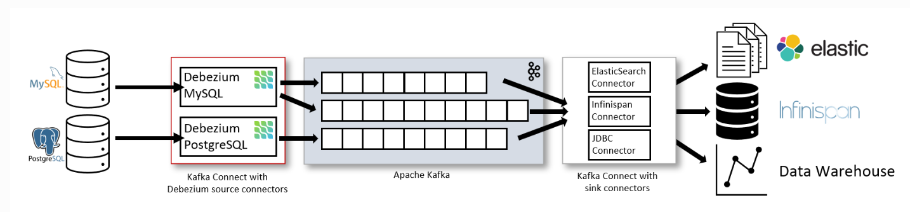

# CDC database using Debezium

## Mô tả dự án
Dự án sử dụng debezium để sync các database với nhau, sử dụng docker compose để build dự án đơn giản hơn:
> - Debezium, Debezium connect
> - PostgreSQL
> - Kafka, kafka UI, Zookeper
> - Docker, docker-compose
> - .Net core console app for Consumer demo

### Setup kết nối debezium tới PostgreSQL
- Dùng postman để gọi tới: http://localhost:8083/connectors
>HTTP METHOD POST
>HEADER: 
>    Content-Type: application/json
>BODY: 
> `{
>     "name": "inventory-connector",
>     "config": {
>         "connector.class": "io.debezium.connector.postgresql.PostgresConnector",
>         "database.hostname": "postgres",
>         "database.port": "5432",
>         "database.user": "postgres",
>         "database.password": "postgres",
>         "database.dbname": "inventory",
>         "topic.prefix": "cdc-db",
>         "table.include.list": "inventory.customers",
>         "plugin.name": "pgoutput",
>         "slot.name": "debezium_slot",
>         "publication.name": "debezium_pub",
>         "name": "inventory-connector"
>     },
>     "tasks": [],
>     "type": "source"
> }`
